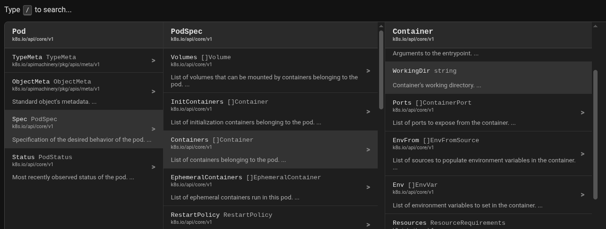

# Resource Explorer

Generates documentation for Go plain-old-data style APIs (e.g. Kubernetes) in a
multi-column format. An example of the output can be [found here][example].



## Usage

```bash
# Build rex.
$ make

# Generate documentation for the resources in core/v1 and networking/v1.
#
# You may need to `go get` missing package sources to get a complete picture of
# all of the types used.

$ ./rex -output=/tmp/index.html -type k8s.io/api/core/v1.Pod ~/work/api/core/v1 ~/work/api/networking/v1
```

[example]: https://bowei.github.io/k8s/core.html#k8s.io/api/core/v1.Pod/Spec/Containers/WorkingDir
